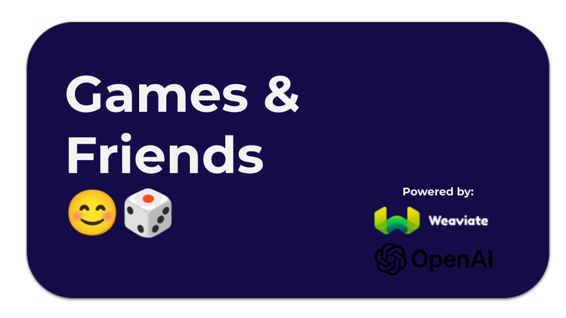

## Games and Friends 😊🎲

Love board games? In this demo we build a workflow with Weaviate (Python v.4) and OpenAI to query our database suggests games to play and friends to play them with using natural language prompts.

This demo is split into two parts (and two notebooks):

-  Part 1: Weaviate Client and Generative Search
-  Part 2: Open AI Function Calling

Throughout our demo we will:
- Connect to Weaviate Cloud Database client instance
- Import and review our dataset(s)
- Create "Game" and "Player" Collections and Schema
- Populate the Collections by importing data using two methods:
  - Batch: `batch.dynamic()` 
  - Insert:  `insert_many()`
- Execute Generative Search on Collections
- Create functions to update and query the database
- Establish OpenAI Function Calling
- Demo games and friends

### 🔑 API Keys:
For this demo you will need API Keys from:
- Weaviate Cloud Database Instance
- OpenAI

#### Happy Coding!

